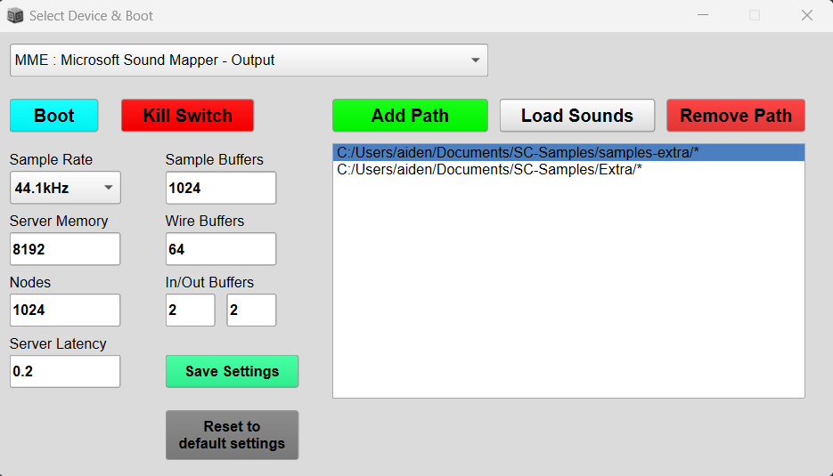
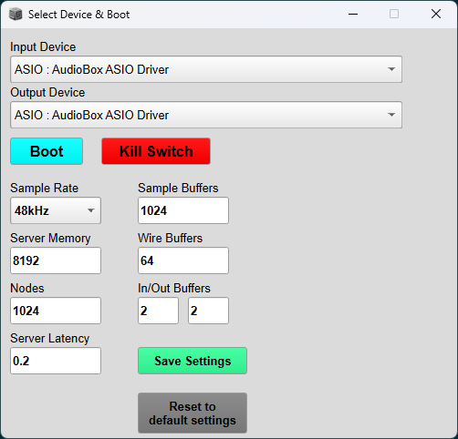

# Server Configuration GUI

This is a simple GUI for configuring the SuperCollider local server and SuperDirt for use with TidalCycles. The goal of this project is to make it easier for new users to get started with TidalCycles and SuperCollider.

### Tidal Start GUI

### Server Config GUI

## Installation

Download the [latest release](https://github.com/intothebeans/SC-ServerConfigGUI/releases/download/v1.1.0/SC-ServerConfigGUI-v1.1.0.zip) and evaluate `Quarks.install("path/to/directory")` in SuperCollider.

## Bugs

This is a new project which hasn't been thouroughly tested. Open [issues](https://github.com/intothebeans/SC-ServerConfigGUI/issues) on GitHub, and I'll try to fix them ASAP.

## Request Features

If there is a feature you think would be beneficial for this project, open an [issue](https://github.com/intothebeans/SC-ServerConfigGUI/issues).
